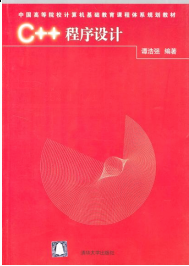

:orphan:

无脑流的C++题解
=====================================

这份题解，咧威会把自己解题思路和涉及到的知识写下来，尽量让每个同学能看懂。如果还有什么问题，可以给咧威留言，或者直接通过新浪微博和电子邮件联系。

.. include:: contents.rst.inc

Indices and tables
==================

* :ref:`genindex`
* :ref:`modindex`
* :ref:`search`

